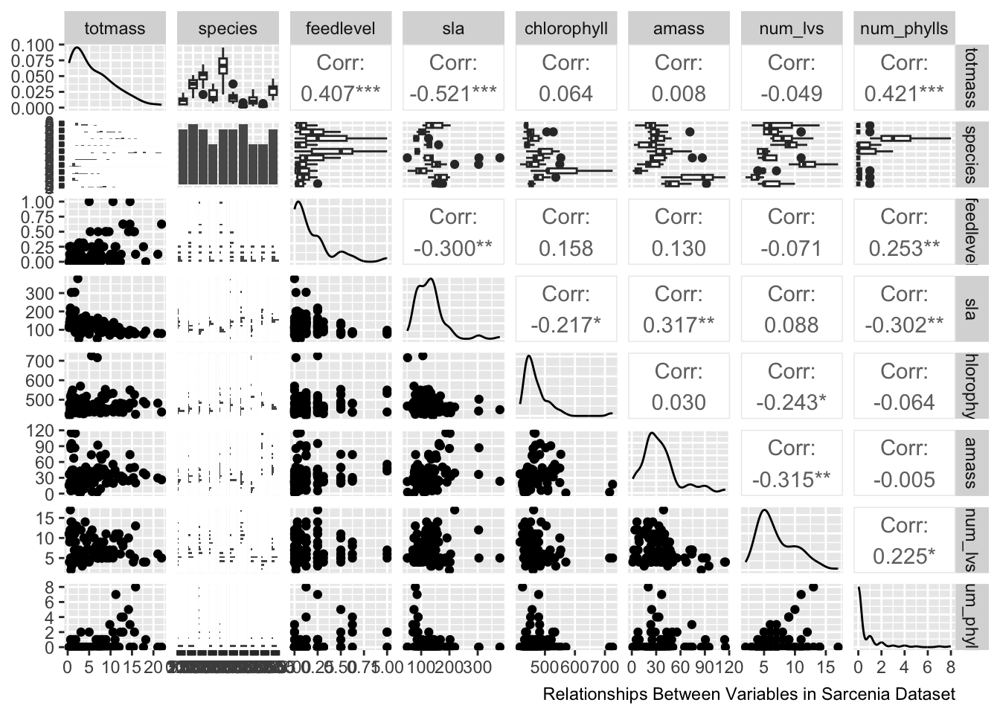
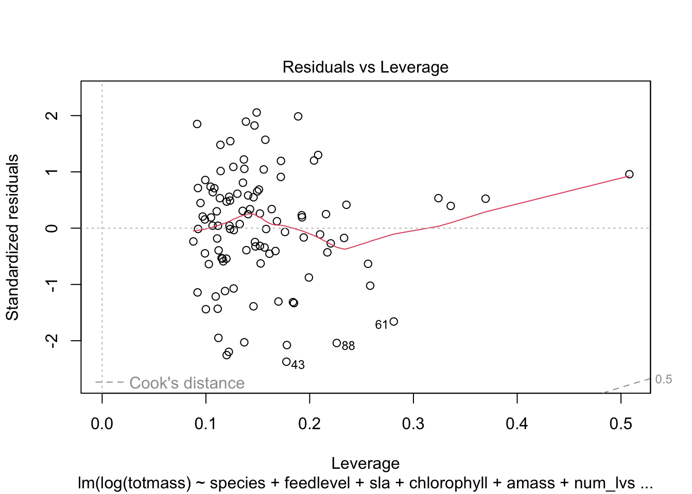
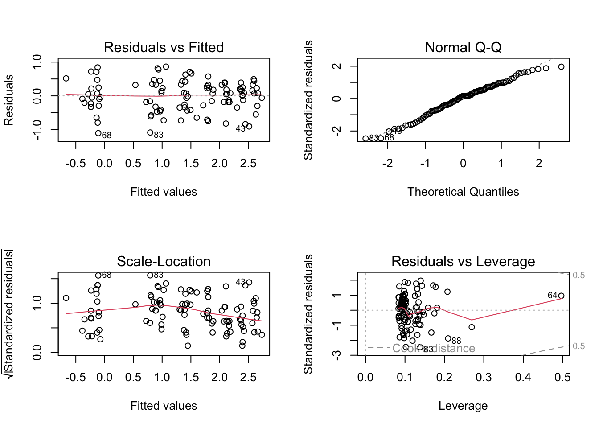

Date: June 6th 2023

Name: Rylee Pupa

github: https://github.com/kiyapupa/ENVS193DS-Homework5

html: unable to do so even with git pages enabled

## Introduction
Sarracenia are a species of carnivorous pitcher plants, which are of high interest to scientists due to their unique capacity to attract insects from their smell for feeding on (Lyczko et al). In addition, certain species of Sarracenia such as Sarracenia pupurea are used in ethnobotany to fight illnesses such as type 2 diabetes and cancer (Huang et al). Carnivorous plants such as Sarracenia are also an ideal species for studying plant molecular genetics and evolutionary ecology because of the convergent traits they possess for digesting prey (Ellison et al). It is important to predict biomass from  physiological, taxonomic, and morphological characteristics because we may be able to tell how big any species of Sarracenia will be based on how big the leaves are, how much they are fed, what the species is, or the chlorophyll content. This will help us understand what factors are important in determining how big a plant gets, so we can understand what environment certain plants are thriving in and also understand the necessary conditions to produce a certain size of pitcher plant. Since these plants are often used in research, it is important to be able to breed them correctly and also understand how species relates to biomass. The question being addressed in the following analysis is whether or not one variable or a combination of the variables within a subset of the dataset can be used to predict the biomass of the plant. We will be checking if the errors for each model are homoscedastic and normally distributed. The null hypothesis being tested in the following analysis is that no variables in the model will predict the biomass, and the alternative hypothesis is that at least one variable in the model will predict biomass.   

::: {.cell}

```{.r .cell-code}
#set up libraries
library(tidyverse)
library(here)
library(janitor)
library(ggeffects)
library(performance)
library(naniar)
library(flextable)
library(car)
library(broom)
library(corrplot)
library(AICcmodavg)
library(GGally)
library(MuMIn)
```
:::


## Methods
  To sample the necessary data, two plants from each Sarracenia species were assigned to six feeding levels, with 120 total plants (Ellison et al). The design for the feeding levels ranged from 0-0.25g of ground wasps for small species, 0-0.5g for intermediate sized, and 0-1g for large species (Ellison et al). The size above ground and Amass (mass-based light-saturated photosynthetic rate of youngest leaf) was taken before treatments, and then the plants were fed once a week for seven weeks (Ellison et al). 
  The data was cleaned to get rid of unnecessary characters and to make column names lower case. The columns of interest for predictor variables were then selected (totmass, species, feedlevel, sla, chlorophyll, amass, num_lvs, num_phylls).

::: {.cell}

```{.r .cell-code}
#read in csv using here function
plants <- read_csv(here("data", "hf109-01-sarracenia.csv")) %>% 
          #cleans names and makes column names lowercase
          clean_names %>% 
          #select columns of interest
          select(totmass, species, feedlevel, sla, chlorophyll, amass, num_lvs, num_phylls)
```
:::

  The missing data was visualized within the Sarracenia data set. The results show that there was missing data for chlorophyll, amass, sla, num_phylls, and num_lvs. The most missing data was in chlorphyll and amass.

::: {.cell}

```{.r .cell-code}
#visualize missing data, add caption, adjust caption
gg_miss_var(plants)   +
  labs(caption = "Missing Data in the Sarracenia Dataset") +
  theme(plot.caption = element_text(hjust = 0.6))
```

::: {.cell-output-display}
{width=672}
:::
:::

  Next, a subset of the data was created in which all of the NA values were dropped from the species columns with missing data.

::: {.cell}

```{.r .cell-code}
#subset data and drop NA values
plant_subset <- plants %>% 
  drop_na(sla, chlorophyll, amass, num_lvs, num_phylls)
```
:::

In order to visualize the respective correlation between the subsetted variables, a Pearson's correlation function was conducted and then this was visualized using a correlation plot. There is a high correlation between sla and amass as well as num_phylls and feedlevel. There is low correlation between num_lvs and amass as well as sla and num_phylls.

::: {.cell}

```{.r .cell-code}
#Calculate Pearson's r for numerics, columns feet level through numphylls
plant_correlation <- plant_subset %>% 
  select(feedlevel:num_phylls) %>% 
  cor(method = "pearson")
#Correlation analysis plot and changing shape of cells, negative indicating weak correlation and positive indicating strong correlation
corrplot(plant_correlation, method = "ellipse", addCoef.col = "black")
title(sub="Pearson's correlation between Sarracenia characteristics and biomass")
```

::: {.cell-output-display}
{width=672}
:::

```{.r .cell-code}
#caption, cannot connect caption argument to corr plot, tried to add it using different function but couldn't adjust margin
```
:::

  Next, a ggpairs plot was created for all columns in the plant subset in order to visualize respective relationships between variables. The visualization shows the relationship between sets of paired variables and also gives correlation values that are not relevant to the analysis but could show dependency between variables. 


::: {.cell}

```{.r .cell-code}
plant_subset %>% 
  select(totmass:num_phylls) %>% 
  ggpairs() + labs(caption ="Relationships Between Variables in Sarcenia Dataset")
```

::: {.cell-output-display}
{width=672}
:::
:::

We fit multiple linear models to see if the species and the characteristics of them may predict biomass. There was a linear model created for each variable (full) and for a null model to compare it to as the control non-predictor model. The full can be used to test for heteroskedasticity and normality whereas the null is just the basis to compare it to. 

::: {.cell}

```{.r .cell-code}
#create null linear model from subset where total mass is 1
null <- lm(totmass ~ 1, data = plant_subset)
#create full linear model where all of the possible predictor columns are included
full <- lm(totmass ~ species + feedlevel + sla + chlorophyll + amass + num_lvs + num_phylls, data = plant_subset)

#show outputs
null 
```

::: {.cell-output .cell-output-stdout}
```

Call:
lm(formula = totmass ~ 1, data = plant_subset)

Coefficients:
(Intercept)  
      6.022  
```
:::

```{.r .cell-code}
full
```

::: {.cell-output .cell-output-stdout}
```

Call:
lm(formula = totmass ~ species + feedlevel + sla + chlorophyll + 
    amass + num_lvs + num_phylls, data = plant_subset)

Coefficients:
       (Intercept)        speciesalata        speciesflava      speciesjonesii  
        -3.9556483           5.7430563           7.8471637           0.8654317  
speciesleucophylla        speciesminor   speciespsittacina     speciespurpurea  
        12.6365468           1.7674245          -4.1933985          -0.4017356  
      speciesrosea        speciesrubra           feedlevel                 sla  
        -0.3930562           4.0927812          -2.0816474          -0.0094688  
       chlorophyll               amass             num_lvs          num_phylls  
         0.0111793           0.0001326           0.4668255          -0.0023333  
```
:::
:::

  Using the linear models we just created, we will plot them using diagnostic plots to look for normality and homoskedasticity of residuals. The visual plots showed non-normality and homoskedasticity because the data in the residuals versus plotted is not evenly and randomly distibuted, there is outliers in the Normal QQ plot, the values in the scale location plot are not randomly and normally distributed, and Cook's model shows outliers are influencing our model. Non-normality was also tested statistically using the Shapiro-Wilk test and heteroskedasticiy was tested for using the Breusch-Pagan test, and both tests showed non-constant error variance and non-normality.    

::: {.cell}

```{.r .cell-code}
#set parameters for plot, splitting screen
par(mfrow = c(2, 2))
#plot full linear model
plot(full) 
```

::: {.cell-output-display}
{width=672}
:::

```{.r .cell-code}
#add caption
labs(caption ="Diagnostics for Full Model")
```

::: {.cell-output .cell-output-stdout}
```
$caption
[1] "Diagnostics for Full Model"

attr(,"class")
[1] "labels"
```
:::

```{.r .cell-code}
#check normality and heteroscedasticity statistically
check_normality(full)
```

::: {.cell-output .cell-output-stdout}
```
Warning: Non-normality of residuals detected (p < .001).
```
:::

```{.r .cell-code}
check_heteroscedasticity(full)
```

::: {.cell-output .cell-output-stdout}
```
Warning: Heteroscedasticity (non-constant error variance) detected (p < .001).
```
:::
:::

  After finding that the linear model was heteroskedastic and non-normal, used the log function within the linear model in order to create a log transformation of the response variable. This removes the heteroskedasticity in the error and makes the error normally distributed. 

::: {.cell}

```{.r .cell-code}
#perform log transformation on null linear model
null_log <- lm(log(totmass) ~ 1, data = plant_subset)

#perform log transformation on full linear model
full_log <- lm(log(totmass) ~ species + feedlevel + sla + chlorophyll + amass + num_lvs + num_phylls, data = plant_subset)

#plot the full with log transformation
plot(full_log)
```

::: {.cell-output-display}
{width=672}
:::

::: {.cell-output-display}
{width=672}
:::

::: {.cell-output-display}
{width=672}
:::

::: {.cell-output-display}
{width=672}
:::

```{.r .cell-code}
labs(caption ="Diagnostics for Full Model with log")
```

::: {.cell-output .cell-output-stdout}
```
$caption
[1] "Diagnostics for Full Model with log"

attr(,"class")
[1] "labels"
```
:::

```{.r .cell-code}
#check non-normality of the full log 
check_normality(full_log)
```

::: {.cell-output .cell-output-stdout}
```
OK: residuals appear as normally distributed (p = 0.107).
```
:::

```{.r .cell-code}
#check heteroscedasticity of the full log 
check_heteroscedasticity(full_log)
```

::: {.cell-output .cell-output-stdout}
```
OK: Error variance appears to be homoscedastic (p = 0.071).
```
:::
:::

  More models were created with subsets of the full model in order to see what set of predictor variables best explains the response. Species is included in all subsets because it is the highest predictor variable, and then different combinations were tested to see which had the best predicting capacity (based on AIC). 
  Model 3 contains chlorophyll, feedlevel, and species because they had a high correlation in the Pearson model as well as species because it is necessary (see above). The result had a low prediction value when tested (146) and errors were homoscedastic and normal so the model was kept. 
  Model 4 includes species, sla, and amass due to the correlation between the last two variables in pearson's. Since amass and sla are the size of the leaf and the photosynthetic rate it makes sense that they are correlated, and it also showed to be a decent predictor according to the AIC (155). 
  Model 5 includes species, chlorophyll, and sla because even though no strong correlation was found between the second two variables, after testing multiple combos this is the lowest AIC value obtained. 

::: {.cell}

```{.r .cell-code}
#shows how good of a predictor variable species is, not used in model discussion, necessary because of VIF
model2_log <- lm(log(totmass) ~ species, data = plant_subset)

#log model with chlorophyll, feed level, species
model3_log <- lm(log(totmass) ~ chlorophyll + feedlevel + species, data = plant_subset) #second best, chlorophyll and feed level had high correlation

#log model with species, sla, amass
model4_log <- lm(log(totmass) ~ species + sla + amass, data = plant_subset) #bc of correlation in pearson's 

#log model with chlorophyll, sla species
model5_log <- lm(log(totmass) ~ species + chlorophyll + sla, data = plant_subset) #best
```
:::

  Next, we evaluated multicolinearity of the full log and calculated the variance inflation factor, which shows how much one variable is influenced by the other independent variables. The value for the species is incredibly high so it should be included in each model in order to accurately predict so that it does not deeply impact the regression model. The other variables should not be too much of a cause for concern because they all have VIF values less than 5. 

::: {.cell}

```{.r .cell-code}
#evaluate multicollinearity by calculating variance inflation factor 
car::vif(full_log)
```

::: {.cell-output .cell-output-stdout}
```
                 GVIF Df GVIF^(1/(2*Df))
species     42.351675  9        1.231351
feedlevel    1.621993  1        1.273575
sla          1.999989  1        1.414210
chlorophyll  1.949828  1        1.396362
amass        2.872084  1        1.694722
num_lvs      2.813855  1        1.677455
num_phylls   2.995510  1        1.730754
```
:::
:::

  The 4 models were plotted and also were ran through a normality and homoscedasticity test in order to check our assumptions regarding the normal distribution and homoscedasticity of variance. All of the models passed the checks for being normally distributed and homoscedastic. 

::: {.cell}

```{.r .cell-code}
#plotting log models for sets of predictor variables and adding captions 
par(mfrow = c(2, 2))
plot(model3_log)
```

::: {.cell-output-display}
{width=672}
:::

```{.r .cell-code}
labs(caption ="Diagnostics for Model 3 with log")
```

::: {.cell-output .cell-output-stdout}
```
$caption
[1] "Diagnostics for Model 3 with log"

attr(,"class")
[1] "labels"
```
:::

```{.r .cell-code}
par(mfrow = c(2, 2))
plot(model4_log) 
```

::: {.cell-output-display}
{width=672}
:::

```{.r .cell-code}
labs(caption ="Diagnostics for Model 4 with log")
```

::: {.cell-output .cell-output-stdout}
```
$caption
[1] "Diagnostics for Model 4 with log"

attr(,"class")
[1] "labels"
```
:::

```{.r .cell-code}
par(mfrow = c(2, 2))
plot(model5_log) 
```

::: {.cell-output-display}
{width=672}
:::

```{.r .cell-code}
labs(caption ="Diagnostics for Model 5 with log")
```

::: {.cell-output .cell-output-stdout}
```
$caption
[1] "Diagnostics for Model 5 with log"

attr(,"class")
[1] "labels"
```
:::

```{.r .cell-code}
#checking non-normality and heteroscedasticity statistically
check_normality(model2_log)
```

::: {.cell-output .cell-output-stdout}
```
OK: residuals appear as normally distributed (p = 0.374).
```
:::

```{.r .cell-code}
check_heteroscedasticity(model2_log) 
```

::: {.cell-output .cell-output-stdout}
```
OK: Error variance appears to be homoscedastic (p = 0.100).
```
:::

```{.r .cell-code}
check_normality(model3_log)
```

::: {.cell-output .cell-output-stdout}
```
OK: residuals appear as normally distributed (p = 0.139).
```
:::

```{.r .cell-code}
check_heteroscedasticity(model3_log)
```

::: {.cell-output .cell-output-stdout}
```
OK: Error variance appears to be homoscedastic (p = 0.378).
```
:::

```{.r .cell-code}
check_normality(model4_log)
```

::: {.cell-output .cell-output-stdout}
```
OK: residuals appear as normally distributed (p = 0.207).
```
:::

```{.r .cell-code}
check_heteroscedasticity(model4_log)
```

::: {.cell-output .cell-output-stdout}
```
OK: Error variance appears to be homoscedastic (p = 0.088).
```
:::

```{.r .cell-code}
check_normality(model5_log)
```

::: {.cell-output .cell-output-stdout}
```
OK: residuals appear as normally distributed (p = 0.126).
```
:::

```{.r .cell-code}
check_heteroscedasticity(model5_log)
```

::: {.cell-output .cell-output-stdout}
```
OK: Error variance appears to be homoscedastic (p = 0.162).
```
:::
:::

Models were then compared using Akaike's Information criterion (AIC) values, which gives a gauge of how much a model predicts a given variable, but only in relation to the other variables. 

::: {.cell}

```{.r .cell-code}
#calculating AICc for each model created and for the full model
AICc(full_log)
```

::: {.cell-output .cell-output-stdout}
```
[1] 133.9424
```
:::

```{.r .cell-code}
AICc(null_log)
```

::: {.cell-output .cell-output-stdout}
```
[1] 306.0028
```
:::

```{.r .cell-code}
AICc(model2_log)
```

::: {.cell-output .cell-output-stdout}
```
[1] 157.5751
```
:::

```{.r .cell-code}
AICc(model3_log)
```

::: {.cell-output .cell-output-stdout}
```
[1] 146.4839
```
:::

```{.r .cell-code}
AICc(model4_log)
```

::: {.cell-output .cell-output-stdout}
```
[1] 155.746
```
:::

```{.r .cell-code}
AICc(model5_log)
```

::: {.cell-output .cell-output-stdout}
```
[1] 144.5498
```
:::

```{.r .cell-code}
#comparing the AICc values across allmodels with null as control with AICc and df table
MuMIn::AICc(full_log, model2_log, null_log, model3_log, model4_log, model5_log)
```

::: {.cell-output .cell-output-stdout}
```
           df     AICc
full_log   17 133.9424
model2_log 11 157.5751
null_log    2 306.0028
model3_log 13 146.4839
model4_log 13 155.7460
model5_log 13 144.5498
```
:::

```{.r .cell-code}
#making model selection tables
MuMIn::model.sel(full_log, model2_log, null_log, model3_log, model4_log, model5_log)
```

::: {.cell-output .cell-output-stdout}
```
Model selection table 
             (Int)      ams      chl     fdl num_lvs  num_phy       sla spc df
full_log   -1.3390 0.002338 0.004368 -0.4743 0.09176 -0.03959 -0.002493   + 17
model5_log -0.6233          0.004190                          -0.002229   + 13
model3_log -1.2190          0.004875 -0.3500                              + 13
model4_log  1.2930 0.002964                                   -0.003257   + 13
model2_log  0.8836                                                        + 11
null_log    1.3500                                                           2
             logLik  AICc  delta weight
full_log    -46.371 133.9   0.00  0.993
model5_log  -57.230 144.5  10.61  0.005
model3_log  -58.197 146.5  12.54  0.002
model4_log  -62.828 155.7  21.80  0.000
model2_log  -66.337 157.6  23.63  0.000
null_log   -150.941 306.0 172.06  0.000
Models ranked by AICc(x) 
```
:::
:::

## Results
  Using the AIC, we compared models and chose the value with the lowest value which was model 5. The actual lowest value was full log but since we wanted a subset of models that has the lowest explanatory values, model 5 is the best choice. Model 3 and Model 4 also have low values to predict biomass but strong as good as 5. The null value for AIC serves as a control for when nothing is predicted to compare to, and with model 2 also having a small value we can see that species is very important in biomass prediction. 
  We found that Model 5 including the species, chlorophyll, and sla predictors best predicted biomass. The errors are normally distributed and homoscedastic, which can be seen in the table below. The estimate values of 1.004 for chlorophyll and 0.998 for sla show that there is highly linear relationship between total mass and these two variables per species. The low values for standard error for both .001 show that there is not a large deviance from the estimates to the real data which further shows strong prediction. The respect statistic value's deviance from 1 for chlorophyll and sla (3.372 and -1.923) also shows strong prediction. 

::: {.cell}

```{.r .cell-code}
#summarize the model
summary(model5_log)
```

::: {.cell-output .cell-output-stdout}
```

Call:
lm(formula = log(totmass) ~ species + chlorophyll + sla, data = plant_subset)

Residuals:
    Min      1Q  Median      3Q     Max 
-0.9165 -0.2678  0.0326  0.2904  0.8468 

Coefficients:
                    Estimate Std. Error t value Pr(>|t|)    
(Intercept)        -0.623255   0.610423  -1.021   0.3100    
speciesalata        1.053111   0.194139   5.425 4.76e-07 ***
speciesflava        1.278702   0.204145   6.264 1.22e-08 ***
speciesjonesii      0.478908   0.209358   2.288   0.0245 *  
speciesleucophylla  1.362614   0.211733   6.436 5.65e-09 ***
speciesminor        0.259420   0.199606   1.300   0.1970    
speciespsittacina  -1.202239   0.191698  -6.272 1.18e-08 ***
speciespurpurea    -0.579995   0.260204  -2.229   0.0283 *  
speciesrosea       -1.161180   0.218743  -5.308 7.76e-07 ***
speciesrubra        0.861714   0.192469   4.477 2.19e-05 ***
chlorophyll         0.004190   0.001242   3.372   0.0011 ** 
sla                -0.002229   0.001159  -1.923   0.0577 .  
---
Signif. codes:  0 '***' 0.001 '**' 0.01 '*' 0.05 '.' 0.1 ' ' 1

Residual standard error: 0.4487 on 91 degrees of freedom
Multiple R-squared:  0.8379,	Adjusted R-squared:  0.8183 
F-statistic: 42.77 on 11 and 91 DF,  p-value: < 2.2e-16
```
:::

```{.r .cell-code}
#create table out of summary 
table <- tidy(model5_log, conf.int = TRUE, exponentiate = TRUE) %>% 
#change low p-values to .001, change all values to round to 3 digits using mutate function
  mutate(statistic = round(statistic, digits = 3)) %>%
  mutate(std.error = round(std.error, digits = 3)) %>%
  mutate(conf.low = round(conf.low, digits = 3)) %>%
  mutate(conf.high = round(conf.high, digits = 3)) %>%
  mutate(estimate = round(estimate, digits = 3)) %>%
  mutate(p.value = case_when(p.value < 0.001 ~ "< 0.001")) %>% 
#create flextable
  flextable() %>% 
#fitting table to viewer
  autofit()
#show table 
  table
```

::: {.cell-output-display}
```{=html}
<div class="tabwid"><style>.cl-c8dd31b0{}.cl-c8cdef02{font-family:'Helvetica';font-size:11pt;font-weight:normal;font-style:normal;text-decoration:none;color:rgba(0, 0, 0, 1.00);background-color:transparent;}.cl-c8d43326{margin:0;text-align:left;border-bottom: 0 solid rgba(0, 0, 0, 1.00);border-top: 0 solid rgba(0, 0, 0, 1.00);border-left: 0 solid rgba(0, 0, 0, 1.00);border-right: 0 solid rgba(0, 0, 0, 1.00);padding-bottom:5pt;padding-top:5pt;padding-left:5pt;padding-right:5pt;line-height: 1;background-color:transparent;}.cl-c8d4333a{margin:0;text-align:right;border-bottom: 0 solid rgba(0, 0, 0, 1.00);border-top: 0 solid rgba(0, 0, 0, 1.00);border-left: 0 solid rgba(0, 0, 0, 1.00);border-right: 0 solid rgba(0, 0, 0, 1.00);padding-bottom:5pt;padding-top:5pt;padding-left:5pt;padding-right:5pt;line-height: 1;background-color:transparent;}.cl-c8d45b94{width:1.568in;background-color:transparent;vertical-align: middle;border-bottom: 1.5pt solid rgba(102, 102, 102, 1.00);border-top: 1.5pt solid rgba(102, 102, 102, 1.00);border-left: 0 solid rgba(0, 0, 0, 1.00);border-right: 0 solid rgba(0, 0, 0, 1.00);margin-bottom:0;margin-top:0;margin-left:0;margin-right:0;}.cl-c8d45b9e{width:0.863in;background-color:transparent;vertical-align: middle;border-bottom: 1.5pt solid rgba(102, 102, 102, 1.00);border-top: 1.5pt solid rgba(102, 102, 102, 1.00);border-left: 0 solid rgba(0, 0, 0, 1.00);border-right: 0 solid rgba(0, 0, 0, 1.00);margin-bottom:0;margin-top:0;margin-left:0;margin-right:0;}.cl-c8d45ba8{width:0.854in;background-color:transparent;vertical-align: middle;border-bottom: 1.5pt solid rgba(102, 102, 102, 1.00);border-top: 1.5pt solid rgba(102, 102, 102, 1.00);border-left: 0 solid rgba(0, 0, 0, 1.00);border-right: 0 solid rgba(0, 0, 0, 1.00);margin-bottom:0;margin-top:0;margin-left:0;margin-right:0;}.cl-c8d45bb2{width:0.795in;background-color:transparent;vertical-align: middle;border-bottom: 1.5pt solid rgba(102, 102, 102, 1.00);border-top: 1.5pt solid rgba(102, 102, 102, 1.00);border-left: 0 solid rgba(0, 0, 0, 1.00);border-right: 0 solid rgba(0, 0, 0, 1.00);margin-bottom:0;margin-top:0;margin-left:0;margin-right:0;}.cl-c8d45bb3{width:0.799in;background-color:transparent;vertical-align: middle;border-bottom: 1.5pt solid rgba(102, 102, 102, 1.00);border-top: 1.5pt solid rgba(102, 102, 102, 1.00);border-left: 0 solid rgba(0, 0, 0, 1.00);border-right: 0 solid rgba(0, 0, 0, 1.00);margin-bottom:0;margin-top:0;margin-left:0;margin-right:0;}.cl-c8d45bbc{width:0.846in;background-color:transparent;vertical-align: middle;border-bottom: 1.5pt solid rgba(102, 102, 102, 1.00);border-top: 1.5pt solid rgba(102, 102, 102, 1.00);border-left: 0 solid rgba(0, 0, 0, 1.00);border-right: 0 solid rgba(0, 0, 0, 1.00);margin-bottom:0;margin-top:0;margin-left:0;margin-right:0;}.cl-c8d45bc6{width:0.905in;background-color:transparent;vertical-align: middle;border-bottom: 1.5pt solid rgba(102, 102, 102, 1.00);border-top: 1.5pt solid rgba(102, 102, 102, 1.00);border-left: 0 solid rgba(0, 0, 0, 1.00);border-right: 0 solid rgba(0, 0, 0, 1.00);margin-bottom:0;margin-top:0;margin-left:0;margin-right:0;}.cl-c8d45bc7{width:1.568in;background-color:transparent;vertical-align: middle;border-bottom: 0 solid rgba(0, 0, 0, 1.00);border-top: 0 solid rgba(0, 0, 0, 1.00);border-left: 0 solid rgba(0, 0, 0, 1.00);border-right: 0 solid rgba(0, 0, 0, 1.00);margin-bottom:0;margin-top:0;margin-left:0;margin-right:0;}.cl-c8d45bc8{width:0.863in;background-color:transparent;vertical-align: middle;border-bottom: 0 solid rgba(0, 0, 0, 1.00);border-top: 0 solid rgba(0, 0, 0, 1.00);border-left: 0 solid rgba(0, 0, 0, 1.00);border-right: 0 solid rgba(0, 0, 0, 1.00);margin-bottom:0;margin-top:0;margin-left:0;margin-right:0;}.cl-c8d45bd0{width:0.854in;background-color:transparent;vertical-align: middle;border-bottom: 0 solid rgba(0, 0, 0, 1.00);border-top: 0 solid rgba(0, 0, 0, 1.00);border-left: 0 solid rgba(0, 0, 0, 1.00);border-right: 0 solid rgba(0, 0, 0, 1.00);margin-bottom:0;margin-top:0;margin-left:0;margin-right:0;}.cl-c8d45bd1{width:0.795in;background-color:transparent;vertical-align: middle;border-bottom: 0 solid rgba(0, 0, 0, 1.00);border-top: 0 solid rgba(0, 0, 0, 1.00);border-left: 0 solid rgba(0, 0, 0, 1.00);border-right: 0 solid rgba(0, 0, 0, 1.00);margin-bottom:0;margin-top:0;margin-left:0;margin-right:0;}.cl-c8d45bda{width:0.799in;background-color:transparent;vertical-align: middle;border-bottom: 0 solid rgba(0, 0, 0, 1.00);border-top: 0 solid rgba(0, 0, 0, 1.00);border-left: 0 solid rgba(0, 0, 0, 1.00);border-right: 0 solid rgba(0, 0, 0, 1.00);margin-bottom:0;margin-top:0;margin-left:0;margin-right:0;}.cl-c8d45be4{width:0.846in;background-color:transparent;vertical-align: middle;border-bottom: 0 solid rgba(0, 0, 0, 1.00);border-top: 0 solid rgba(0, 0, 0, 1.00);border-left: 0 solid rgba(0, 0, 0, 1.00);border-right: 0 solid rgba(0, 0, 0, 1.00);margin-bottom:0;margin-top:0;margin-left:0;margin-right:0;}.cl-c8d45be5{width:0.905in;background-color:transparent;vertical-align: middle;border-bottom: 0 solid rgba(0, 0, 0, 1.00);border-top: 0 solid rgba(0, 0, 0, 1.00);border-left: 0 solid rgba(0, 0, 0, 1.00);border-right: 0 solid rgba(0, 0, 0, 1.00);margin-bottom:0;margin-top:0;margin-left:0;margin-right:0;}.cl-c8d45be6{width:1.568in;background-color:transparent;vertical-align: middle;border-bottom: 0 solid rgba(0, 0, 0, 1.00);border-top: 0 solid rgba(0, 0, 0, 1.00);border-left: 0 solid rgba(0, 0, 0, 1.00);border-right: 0 solid rgba(0, 0, 0, 1.00);margin-bottom:0;margin-top:0;margin-left:0;margin-right:0;}.cl-c8d45bee{width:0.863in;background-color:transparent;vertical-align: middle;border-bottom: 0 solid rgba(0, 0, 0, 1.00);border-top: 0 solid rgba(0, 0, 0, 1.00);border-left: 0 solid rgba(0, 0, 0, 1.00);border-right: 0 solid rgba(0, 0, 0, 1.00);margin-bottom:0;margin-top:0;margin-left:0;margin-right:0;}.cl-c8d45bef{width:0.854in;background-color:transparent;vertical-align: middle;border-bottom: 0 solid rgba(0, 0, 0, 1.00);border-top: 0 solid rgba(0, 0, 0, 1.00);border-left: 0 solid rgba(0, 0, 0, 1.00);border-right: 0 solid rgba(0, 0, 0, 1.00);margin-bottom:0;margin-top:0;margin-left:0;margin-right:0;}.cl-c8d45bf8{width:0.795in;background-color:transparent;vertical-align: middle;border-bottom: 0 solid rgba(0, 0, 0, 1.00);border-top: 0 solid rgba(0, 0, 0, 1.00);border-left: 0 solid rgba(0, 0, 0, 1.00);border-right: 0 solid rgba(0, 0, 0, 1.00);margin-bottom:0;margin-top:0;margin-left:0;margin-right:0;}.cl-c8d45bf9{width:0.799in;background-color:transparent;vertical-align: middle;border-bottom: 0 solid rgba(0, 0, 0, 1.00);border-top: 0 solid rgba(0, 0, 0, 1.00);border-left: 0 solid rgba(0, 0, 0, 1.00);border-right: 0 solid rgba(0, 0, 0, 1.00);margin-bottom:0;margin-top:0;margin-left:0;margin-right:0;}.cl-c8d45bfa{width:0.846in;background-color:transparent;vertical-align: middle;border-bottom: 0 solid rgba(0, 0, 0, 1.00);border-top: 0 solid rgba(0, 0, 0, 1.00);border-left: 0 solid rgba(0, 0, 0, 1.00);border-right: 0 solid rgba(0, 0, 0, 1.00);margin-bottom:0;margin-top:0;margin-left:0;margin-right:0;}.cl-c8d45c02{width:0.905in;background-color:transparent;vertical-align: middle;border-bottom: 0 solid rgba(0, 0, 0, 1.00);border-top: 0 solid rgba(0, 0, 0, 1.00);border-left: 0 solid rgba(0, 0, 0, 1.00);border-right: 0 solid rgba(0, 0, 0, 1.00);margin-bottom:0;margin-top:0;margin-left:0;margin-right:0;}.cl-c8d45c0c{width:1.568in;background-color:transparent;vertical-align: middle;border-bottom: 0 solid rgba(0, 0, 0, 1.00);border-top: 0 solid rgba(0, 0, 0, 1.00);border-left: 0 solid rgba(0, 0, 0, 1.00);border-right: 0 solid rgba(0, 0, 0, 1.00);margin-bottom:0;margin-top:0;margin-left:0;margin-right:0;}.cl-c8d45c0d{width:0.863in;background-color:transparent;vertical-align: middle;border-bottom: 0 solid rgba(0, 0, 0, 1.00);border-top: 0 solid rgba(0, 0, 0, 1.00);border-left: 0 solid rgba(0, 0, 0, 1.00);border-right: 0 solid rgba(0, 0, 0, 1.00);margin-bottom:0;margin-top:0;margin-left:0;margin-right:0;}.cl-c8d45c16{width:0.854in;background-color:transparent;vertical-align: middle;border-bottom: 0 solid rgba(0, 0, 0, 1.00);border-top: 0 solid rgba(0, 0, 0, 1.00);border-left: 0 solid rgba(0, 0, 0, 1.00);border-right: 0 solid rgba(0, 0, 0, 1.00);margin-bottom:0;margin-top:0;margin-left:0;margin-right:0;}.cl-c8d45c17{width:0.795in;background-color:transparent;vertical-align: middle;border-bottom: 0 solid rgba(0, 0, 0, 1.00);border-top: 0 solid rgba(0, 0, 0, 1.00);border-left: 0 solid rgba(0, 0, 0, 1.00);border-right: 0 solid rgba(0, 0, 0, 1.00);margin-bottom:0;margin-top:0;margin-left:0;margin-right:0;}.cl-c8d45c18{width:0.799in;background-color:transparent;vertical-align: middle;border-bottom: 0 solid rgba(0, 0, 0, 1.00);border-top: 0 solid rgba(0, 0, 0, 1.00);border-left: 0 solid rgba(0, 0, 0, 1.00);border-right: 0 solid rgba(0, 0, 0, 1.00);margin-bottom:0;margin-top:0;margin-left:0;margin-right:0;}.cl-c8d45c20{width:0.846in;background-color:transparent;vertical-align: middle;border-bottom: 0 solid rgba(0, 0, 0, 1.00);border-top: 0 solid rgba(0, 0, 0, 1.00);border-left: 0 solid rgba(0, 0, 0, 1.00);border-right: 0 solid rgba(0, 0, 0, 1.00);margin-bottom:0;margin-top:0;margin-left:0;margin-right:0;}.cl-c8d45c21{width:0.905in;background-color:transparent;vertical-align: middle;border-bottom: 0 solid rgba(0, 0, 0, 1.00);border-top: 0 solid rgba(0, 0, 0, 1.00);border-left: 0 solid rgba(0, 0, 0, 1.00);border-right: 0 solid rgba(0, 0, 0, 1.00);margin-bottom:0;margin-top:0;margin-left:0;margin-right:0;}.cl-c8d45c2a{width:1.568in;background-color:transparent;vertical-align: middle;border-bottom: 0 solid rgba(0, 0, 0, 1.00);border-top: 0 solid rgba(0, 0, 0, 1.00);border-left: 0 solid rgba(0, 0, 0, 1.00);border-right: 0 solid rgba(0, 0, 0, 1.00);margin-bottom:0;margin-top:0;margin-left:0;margin-right:0;}.cl-c8d45c2b{width:0.863in;background-color:transparent;vertical-align: middle;border-bottom: 0 solid rgba(0, 0, 0, 1.00);border-top: 0 solid rgba(0, 0, 0, 1.00);border-left: 0 solid rgba(0, 0, 0, 1.00);border-right: 0 solid rgba(0, 0, 0, 1.00);margin-bottom:0;margin-top:0;margin-left:0;margin-right:0;}.cl-c8d45c34{width:0.854in;background-color:transparent;vertical-align: middle;border-bottom: 0 solid rgba(0, 0, 0, 1.00);border-top: 0 solid rgba(0, 0, 0, 1.00);border-left: 0 solid rgba(0, 0, 0, 1.00);border-right: 0 solid rgba(0, 0, 0, 1.00);margin-bottom:0;margin-top:0;margin-left:0;margin-right:0;}.cl-c8d45c35{width:0.795in;background-color:transparent;vertical-align: middle;border-bottom: 0 solid rgba(0, 0, 0, 1.00);border-top: 0 solid rgba(0, 0, 0, 1.00);border-left: 0 solid rgba(0, 0, 0, 1.00);border-right: 0 solid rgba(0, 0, 0, 1.00);margin-bottom:0;margin-top:0;margin-left:0;margin-right:0;}.cl-c8d45c3e{width:0.799in;background-color:transparent;vertical-align: middle;border-bottom: 0 solid rgba(0, 0, 0, 1.00);border-top: 0 solid rgba(0, 0, 0, 1.00);border-left: 0 solid rgba(0, 0, 0, 1.00);border-right: 0 solid rgba(0, 0, 0, 1.00);margin-bottom:0;margin-top:0;margin-left:0;margin-right:0;}.cl-c8d45c3f{width:0.846in;background-color:transparent;vertical-align: middle;border-bottom: 0 solid rgba(0, 0, 0, 1.00);border-top: 0 solid rgba(0, 0, 0, 1.00);border-left: 0 solid rgba(0, 0, 0, 1.00);border-right: 0 solid rgba(0, 0, 0, 1.00);margin-bottom:0;margin-top:0;margin-left:0;margin-right:0;}.cl-c8d45c40{width:0.905in;background-color:transparent;vertical-align: middle;border-bottom: 0 solid rgba(0, 0, 0, 1.00);border-top: 0 solid rgba(0, 0, 0, 1.00);border-left: 0 solid rgba(0, 0, 0, 1.00);border-right: 0 solid rgba(0, 0, 0, 1.00);margin-bottom:0;margin-top:0;margin-left:0;margin-right:0;}.cl-c8d45c48{width:1.568in;background-color:transparent;vertical-align: middle;border-bottom: 0 solid rgba(0, 0, 0, 1.00);border-top: 0 solid rgba(0, 0, 0, 1.00);border-left: 0 solid rgba(0, 0, 0, 1.00);border-right: 0 solid rgba(0, 0, 0, 1.00);margin-bottom:0;margin-top:0;margin-left:0;margin-right:0;}.cl-c8d45c49{width:0.863in;background-color:transparent;vertical-align: middle;border-bottom: 0 solid rgba(0, 0, 0, 1.00);border-top: 0 solid rgba(0, 0, 0, 1.00);border-left: 0 solid rgba(0, 0, 0, 1.00);border-right: 0 solid rgba(0, 0, 0, 1.00);margin-bottom:0;margin-top:0;margin-left:0;margin-right:0;}.cl-c8d45c52{width:0.854in;background-color:transparent;vertical-align: middle;border-bottom: 0 solid rgba(0, 0, 0, 1.00);border-top: 0 solid rgba(0, 0, 0, 1.00);border-left: 0 solid rgba(0, 0, 0, 1.00);border-right: 0 solid rgba(0, 0, 0, 1.00);margin-bottom:0;margin-top:0;margin-left:0;margin-right:0;}.cl-c8d45c5c{width:0.795in;background-color:transparent;vertical-align: middle;border-bottom: 0 solid rgba(0, 0, 0, 1.00);border-top: 0 solid rgba(0, 0, 0, 1.00);border-left: 0 solid rgba(0, 0, 0, 1.00);border-right: 0 solid rgba(0, 0, 0, 1.00);margin-bottom:0;margin-top:0;margin-left:0;margin-right:0;}.cl-c8d45c5d{width:0.799in;background-color:transparent;vertical-align: middle;border-bottom: 0 solid rgba(0, 0, 0, 1.00);border-top: 0 solid rgba(0, 0, 0, 1.00);border-left: 0 solid rgba(0, 0, 0, 1.00);border-right: 0 solid rgba(0, 0, 0, 1.00);margin-bottom:0;margin-top:0;margin-left:0;margin-right:0;}.cl-c8d45c66{width:0.846in;background-color:transparent;vertical-align: middle;border-bottom: 0 solid rgba(0, 0, 0, 1.00);border-top: 0 solid rgba(0, 0, 0, 1.00);border-left: 0 solid rgba(0, 0, 0, 1.00);border-right: 0 solid rgba(0, 0, 0, 1.00);margin-bottom:0;margin-top:0;margin-left:0;margin-right:0;}.cl-c8d45c67{width:0.905in;background-color:transparent;vertical-align: middle;border-bottom: 0 solid rgba(0, 0, 0, 1.00);border-top: 0 solid rgba(0, 0, 0, 1.00);border-left: 0 solid rgba(0, 0, 0, 1.00);border-right: 0 solid rgba(0, 0, 0, 1.00);margin-bottom:0;margin-top:0;margin-left:0;margin-right:0;}.cl-c8d45c70{width:1.568in;background-color:transparent;vertical-align: middle;border-bottom: 1.5pt solid rgba(102, 102, 102, 1.00);border-top: 0 solid rgba(0, 0, 0, 1.00);border-left: 0 solid rgba(0, 0, 0, 1.00);border-right: 0 solid rgba(0, 0, 0, 1.00);margin-bottom:0;margin-top:0;margin-left:0;margin-right:0;}.cl-c8d45c71{width:0.863in;background-color:transparent;vertical-align: middle;border-bottom: 1.5pt solid rgba(102, 102, 102, 1.00);border-top: 0 solid rgba(0, 0, 0, 1.00);border-left: 0 solid rgba(0, 0, 0, 1.00);border-right: 0 solid rgba(0, 0, 0, 1.00);margin-bottom:0;margin-top:0;margin-left:0;margin-right:0;}.cl-c8d45c72{width:0.854in;background-color:transparent;vertical-align: middle;border-bottom: 1.5pt solid rgba(102, 102, 102, 1.00);border-top: 0 solid rgba(0, 0, 0, 1.00);border-left: 0 solid rgba(0, 0, 0, 1.00);border-right: 0 solid rgba(0, 0, 0, 1.00);margin-bottom:0;margin-top:0;margin-left:0;margin-right:0;}.cl-c8d45c7a{width:0.795in;background-color:transparent;vertical-align: middle;border-bottom: 1.5pt solid rgba(102, 102, 102, 1.00);border-top: 0 solid rgba(0, 0, 0, 1.00);border-left: 0 solid rgba(0, 0, 0, 1.00);border-right: 0 solid rgba(0, 0, 0, 1.00);margin-bottom:0;margin-top:0;margin-left:0;margin-right:0;}.cl-c8d45c84{width:0.799in;background-color:transparent;vertical-align: middle;border-bottom: 1.5pt solid rgba(102, 102, 102, 1.00);border-top: 0 solid rgba(0, 0, 0, 1.00);border-left: 0 solid rgba(0, 0, 0, 1.00);border-right: 0 solid rgba(0, 0, 0, 1.00);margin-bottom:0;margin-top:0;margin-left:0;margin-right:0;}.cl-c8d45c85{width:0.846in;background-color:transparent;vertical-align: middle;border-bottom: 1.5pt solid rgba(102, 102, 102, 1.00);border-top: 0 solid rgba(0, 0, 0, 1.00);border-left: 0 solid rgba(0, 0, 0, 1.00);border-right: 0 solid rgba(0, 0, 0, 1.00);margin-bottom:0;margin-top:0;margin-left:0;margin-right:0;}.cl-c8d45c86{width:0.905in;background-color:transparent;vertical-align: middle;border-bottom: 1.5pt solid rgba(102, 102, 102, 1.00);border-top: 0 solid rgba(0, 0, 0, 1.00);border-left: 0 solid rgba(0, 0, 0, 1.00);border-right: 0 solid rgba(0, 0, 0, 1.00);margin-bottom:0;margin-top:0;margin-left:0;margin-right:0;}</style><table data-quarto-disable-processing='true' class='cl-c8dd31b0'><thead><tr style="overflow-wrap:break-word;"><th class="cl-c8d45b94"><p class="cl-c8d43326"><span class="cl-c8cdef02">term</span></p></th><th class="cl-c8d45b9e"><p class="cl-c8d4333a"><span class="cl-c8cdef02">estimate</span></p></th><th class="cl-c8d45ba8"><p class="cl-c8d4333a"><span class="cl-c8cdef02">std.error</span></p></th><th class="cl-c8d45bb2"><p class="cl-c8d4333a"><span class="cl-c8cdef02">statistic</span></p></th><th class="cl-c8d45bb3"><p class="cl-c8d43326"><span class="cl-c8cdef02">p.value</span></p></th><th class="cl-c8d45bbc"><p class="cl-c8d4333a"><span class="cl-c8cdef02">conf.low</span></p></th><th class="cl-c8d45bc6"><p class="cl-c8d4333a"><span class="cl-c8cdef02">conf.high</span></p></th></tr></thead><tbody><tr style="overflow-wrap:break-word;"><td class="cl-c8d45bc7"><p class="cl-c8d43326"><span class="cl-c8cdef02">(Intercept)</span></p></td><td class="cl-c8d45bc8"><p class="cl-c8d4333a"><span class="cl-c8cdef02">0.536</span></p></td><td class="cl-c8d45bd0"><p class="cl-c8d4333a"><span class="cl-c8cdef02">0.610</span></p></td><td class="cl-c8d45bd1"><p class="cl-c8d4333a"><span class="cl-c8cdef02">-1.021</span></p></td><td class="cl-c8d45bda"><p class="cl-c8d43326"><span class="cl-c8cdef02"></span></p></td><td class="cl-c8d45be4"><p class="cl-c8d4333a"><span class="cl-c8cdef02">0.159</span></p></td><td class="cl-c8d45be5"><p class="cl-c8d4333a"><span class="cl-c8cdef02">1.803</span></p></td></tr><tr style="overflow-wrap:break-word;"><td class="cl-c8d45be6"><p class="cl-c8d43326"><span class="cl-c8cdef02">speciesalata</span></p></td><td class="cl-c8d45bee"><p class="cl-c8d4333a"><span class="cl-c8cdef02">2.867</span></p></td><td class="cl-c8d45bef"><p class="cl-c8d4333a"><span class="cl-c8cdef02">0.194</span></p></td><td class="cl-c8d45bf8"><p class="cl-c8d4333a"><span class="cl-c8cdef02">5.425</span></p></td><td class="cl-c8d45bf9"><p class="cl-c8d43326"><span class="cl-c8cdef02">&lt; 0.001</span></p></td><td class="cl-c8d45bfa"><p class="cl-c8d4333a"><span class="cl-c8cdef02">1.949</span></p></td><td class="cl-c8d45c02"><p class="cl-c8d4333a"><span class="cl-c8cdef02">4.215</span></p></td></tr><tr style="overflow-wrap:break-word;"><td class="cl-c8d45c0c"><p class="cl-c8d43326"><span class="cl-c8cdef02">speciesflava</span></p></td><td class="cl-c8d45c0d"><p class="cl-c8d4333a"><span class="cl-c8cdef02">3.592</span></p></td><td class="cl-c8d45c16"><p class="cl-c8d4333a"><span class="cl-c8cdef02">0.204</span></p></td><td class="cl-c8d45c17"><p class="cl-c8d4333a"><span class="cl-c8cdef02">6.264</span></p></td><td class="cl-c8d45c18"><p class="cl-c8d43326"><span class="cl-c8cdef02">&lt; 0.001</span></p></td><td class="cl-c8d45c20"><p class="cl-c8d4333a"><span class="cl-c8cdef02">2.395</span></p></td><td class="cl-c8d45c21"><p class="cl-c8d4333a"><span class="cl-c8cdef02">5.388</span></p></td></tr><tr style="overflow-wrap:break-word;"><td class="cl-c8d45c2a"><p class="cl-c8d43326"><span class="cl-c8cdef02">speciesjonesii</span></p></td><td class="cl-c8d45c2b"><p class="cl-c8d4333a"><span class="cl-c8cdef02">1.614</span></p></td><td class="cl-c8d45c34"><p class="cl-c8d4333a"><span class="cl-c8cdef02">0.209</span></p></td><td class="cl-c8d45c35"><p class="cl-c8d4333a"><span class="cl-c8cdef02">2.288</span></p></td><td class="cl-c8d45c3e"><p class="cl-c8d43326"><span class="cl-c8cdef02"></span></p></td><td class="cl-c8d45c3f"><p class="cl-c8d4333a"><span class="cl-c8cdef02">1.065</span></p></td><td class="cl-c8d45c40"><p class="cl-c8d4333a"><span class="cl-c8cdef02">2.447</span></p></td></tr><tr style="overflow-wrap:break-word;"><td class="cl-c8d45c48"><p class="cl-c8d43326"><span class="cl-c8cdef02">speciesleucophylla</span></p></td><td class="cl-c8d45c49"><p class="cl-c8d4333a"><span class="cl-c8cdef02">3.906</span></p></td><td class="cl-c8d45c52"><p class="cl-c8d4333a"><span class="cl-c8cdef02">0.212</span></p></td><td class="cl-c8d45c5c"><p class="cl-c8d4333a"><span class="cl-c8cdef02">6.436</span></p></td><td class="cl-c8d45c5d"><p class="cl-c8d43326"><span class="cl-c8cdef02">&lt; 0.001</span></p></td><td class="cl-c8d45c66"><p class="cl-c8d4333a"><span class="cl-c8cdef02">2.565</span></p></td><td class="cl-c8d45c67"><p class="cl-c8d4333a"><span class="cl-c8cdef02">5.949</span></p></td></tr><tr style="overflow-wrap:break-word;"><td class="cl-c8d45be6"><p class="cl-c8d43326"><span class="cl-c8cdef02">speciesminor</span></p></td><td class="cl-c8d45bee"><p class="cl-c8d4333a"><span class="cl-c8cdef02">1.296</span></p></td><td class="cl-c8d45bef"><p class="cl-c8d4333a"><span class="cl-c8cdef02">0.200</span></p></td><td class="cl-c8d45bf8"><p class="cl-c8d4333a"><span class="cl-c8cdef02">1.300</span></p></td><td class="cl-c8d45bf9"><p class="cl-c8d43326"><span class="cl-c8cdef02"></span></p></td><td class="cl-c8d45bfa"><p class="cl-c8d4333a"><span class="cl-c8cdef02">0.872</span></p></td><td class="cl-c8d45c02"><p class="cl-c8d4333a"><span class="cl-c8cdef02">1.927</span></p></td></tr><tr style="overflow-wrap:break-word;"><td class="cl-c8d45be6"><p class="cl-c8d43326"><span class="cl-c8cdef02">speciespsittacina</span></p></td><td class="cl-c8d45bee"><p class="cl-c8d4333a"><span class="cl-c8cdef02">0.301</span></p></td><td class="cl-c8d45bef"><p class="cl-c8d4333a"><span class="cl-c8cdef02">0.192</span></p></td><td class="cl-c8d45bf8"><p class="cl-c8d4333a"><span class="cl-c8cdef02">-6.272</span></p></td><td class="cl-c8d45bf9"><p class="cl-c8d43326"><span class="cl-c8cdef02">&lt; 0.001</span></p></td><td class="cl-c8d45bfa"><p class="cl-c8d4333a"><span class="cl-c8cdef02">0.205</span></p></td><td class="cl-c8d45c02"><p class="cl-c8d4333a"><span class="cl-c8cdef02">0.440</span></p></td></tr><tr style="overflow-wrap:break-word;"><td class="cl-c8d45be6"><p class="cl-c8d43326"><span class="cl-c8cdef02">speciespurpurea</span></p></td><td class="cl-c8d45bee"><p class="cl-c8d4333a"><span class="cl-c8cdef02">0.560</span></p></td><td class="cl-c8d45bef"><p class="cl-c8d4333a"><span class="cl-c8cdef02">0.260</span></p></td><td class="cl-c8d45bf8"><p class="cl-c8d4333a"><span class="cl-c8cdef02">-2.229</span></p></td><td class="cl-c8d45bf9"><p class="cl-c8d43326"><span class="cl-c8cdef02"></span></p></td><td class="cl-c8d45bfa"><p class="cl-c8d4333a"><span class="cl-c8cdef02">0.334</span></p></td><td class="cl-c8d45c02"><p class="cl-c8d4333a"><span class="cl-c8cdef02">0.939</span></p></td></tr><tr style="overflow-wrap:break-word;"><td class="cl-c8d45be6"><p class="cl-c8d43326"><span class="cl-c8cdef02">speciesrosea</span></p></td><td class="cl-c8d45bee"><p class="cl-c8d4333a"><span class="cl-c8cdef02">0.313</span></p></td><td class="cl-c8d45bef"><p class="cl-c8d4333a"><span class="cl-c8cdef02">0.219</span></p></td><td class="cl-c8d45bf8"><p class="cl-c8d4333a"><span class="cl-c8cdef02">-5.308</span></p></td><td class="cl-c8d45bf9"><p class="cl-c8d43326"><span class="cl-c8cdef02">&lt; 0.001</span></p></td><td class="cl-c8d45bfa"><p class="cl-c8d4333a"><span class="cl-c8cdef02">0.203</span></p></td><td class="cl-c8d45c02"><p class="cl-c8d4333a"><span class="cl-c8cdef02">0.484</span></p></td></tr><tr style="overflow-wrap:break-word;"><td class="cl-c8d45c2a"><p class="cl-c8d43326"><span class="cl-c8cdef02">speciesrubra</span></p></td><td class="cl-c8d45c2b"><p class="cl-c8d4333a"><span class="cl-c8cdef02">2.367</span></p></td><td class="cl-c8d45c34"><p class="cl-c8d4333a"><span class="cl-c8cdef02">0.192</span></p></td><td class="cl-c8d45c35"><p class="cl-c8d4333a"><span class="cl-c8cdef02">4.477</span></p></td><td class="cl-c8d45c3e"><p class="cl-c8d43326"><span class="cl-c8cdef02">&lt; 0.001</span></p></td><td class="cl-c8d45c3f"><p class="cl-c8d4333a"><span class="cl-c8cdef02">1.615</span></p></td><td class="cl-c8d45c40"><p class="cl-c8d4333a"><span class="cl-c8cdef02">3.470</span></p></td></tr><tr style="overflow-wrap:break-word;"><td class="cl-c8d45c48"><p class="cl-c8d43326"><span class="cl-c8cdef02">chlorophyll</span></p></td><td class="cl-c8d45c49"><p class="cl-c8d4333a"><span class="cl-c8cdef02">1.004</span></p></td><td class="cl-c8d45c52"><p class="cl-c8d4333a"><span class="cl-c8cdef02">0.001</span></p></td><td class="cl-c8d45c5c"><p class="cl-c8d4333a"><span class="cl-c8cdef02">3.372</span></p></td><td class="cl-c8d45c5d"><p class="cl-c8d43326"><span class="cl-c8cdef02"></span></p></td><td class="cl-c8d45c66"><p class="cl-c8d4333a"><span class="cl-c8cdef02">1.002</span></p></td><td class="cl-c8d45c67"><p class="cl-c8d4333a"><span class="cl-c8cdef02">1.007</span></p></td></tr><tr style="overflow-wrap:break-word;"><td class="cl-c8d45c70"><p class="cl-c8d43326"><span class="cl-c8cdef02">sla</span></p></td><td class="cl-c8d45c71"><p class="cl-c8d4333a"><span class="cl-c8cdef02">0.998</span></p></td><td class="cl-c8d45c72"><p class="cl-c8d4333a"><span class="cl-c8cdef02">0.001</span></p></td><td class="cl-c8d45c7a"><p class="cl-c8d4333a"><span class="cl-c8cdef02">-1.923</span></p></td><td class="cl-c8d45c84"><p class="cl-c8d43326"><span class="cl-c8cdef02"></span></p></td><td class="cl-c8d45c85"><p class="cl-c8d4333a"><span class="cl-c8cdef02">0.995</span></p></td><td class="cl-c8d45c86"><p class="cl-c8d4333a"><span class="cl-c8cdef02">1.000</span></p></td></tr></tbody></table></div>
```
:::
:::

  I used gg predict to backtransform estimates and show a plot for a specified predictor variable, for which I chose chlorophyll. I chose this variable because even when used alone with species it still has a low AIC which shows it has a strong ability to predict biomass. When used on a per species basis there is a correlation that shows ability to predict biomass.
  Biologically, using chlorophyll a + b content (mg/g) of the youngest full-expanded leaf to predict biomass shows that there is a correlation between how much chlorophyll a plant has and what it's weight will be. The predictions were sorted by species, so we can assume for each species that if they have a singular plant has a certain chlorophyll content it can be used to assess how dense the plant will be. The graph also shows that as chlorophyll content increases in a species, so does biomass.

::: {.cell}

```{.r .cell-code}
#using gg predict to backtransform estimates and model one variable. Using full log dataset and using species due to it's high effect on other 
model_pred <- ggpredict(model5_log, terms = "species", back.transform = TRUE)

plot(ggpredict(model5_log, terms = "chlorophyll", back.transform = TRUE), add.data = TRUE) + theme_classic() +  labs(x = "Chlorophyll (mg/g)" , y = "Total Biomass", caption ="Chlorophyll as a Predictor Variable for Biomass") + theme(plot.caption = element_text(hjust = 0.5))
```

::: {.cell-output-display}
{width=672}
:::

```{.r .cell-code}
#Extended caption: Chlorophyll can be used to predict biomass on a per species basis in the genus Sarracenia.
model_pred
```

::: {.cell-output .cell-output-stdout}
```
# Predicted values of totmass

species     | Predicted |        95% CI
---------------------------------------
alabamensis |      2.90 | [2.18,  3.84]
alata       |      8.30 | [6.36, 10.83]
flava       |     10.40 | [7.78, 13.90]
jonesii     |      4.67 | [3.38,  6.46]
minor       |      3.75 | [2.84,  4.96]
psittacina  |      0.87 | [0.66,  1.14]
purpurea    |      1.62 | [1.10,  2.39]
rubra       |      6.85 | [5.21,  9.02]

Adjusted for:
* chlorophyll = 471.29
*         sla = 129.27
```
:::
:::


# References
Ellison, Aaron and Farnsworth, Elizabeth. "Effects of Prey Availability on Sarracenia Physiology at Harvard Forest 2005." Environmental Data Initiative, ver 18, 2021. https://doi.org/10.6073/pasta/26b22d09279e62fd729ffc35f9ef0174.

Ellison, Aaron and Gotelli, Nicholas. "Energetics and the evolution of carnivorous plantsDarwin's most wonderful plants in the world." Journal of Experimental Botany, vol. 60, no. 1, 2009, pp 1942. https://doi.org/10.1093/jxb/ern179

Huang, Yen-Hua, et al. "Anticancer and Antioxidant Activities of the Root Extract of the Carnivorous Pitcher Plant Sarracenia purpurea." Plants, vol. 11, no. 13, 2022. doi: 10.3390/plants11131668.

yczko, Jacek, et al. "Sarracenia alata (Alph.Wood) Alph.Wood Microcuttings as a Source of Volatiles Potentially Responsible for Insects' Respond." Molecules, vol. 15, no. 9, 2021. doi: 10.3390/molecules26092406. PMID: 33919120; PMCID: PMC8122457.

